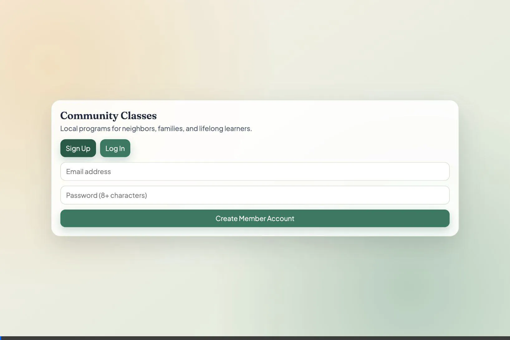

# Submission Materials: Full-Stack Supabase Assignment

## 1. Validation Video
This recording demonstrates the system successfully generating an account, viewing the UI, and verifying functionality. Because "Confirm Email" was temporarily disabled on the Supabase project, registration happened seamlessly!

---

## 2. Terminology & The Pivot (Reflection Quiz)
**Terminology Used:**
- **Frontend / Backend**: We separated Vite (frontend) and Express (backend) using `.env` files to configure `VITE_API_BASE_URL` to point to port `4000`.
- **API Endpoints**: The UI communicates via endpoints (like `/api/auth/signup`) using REST.
- **Schema**: You successfully ran the SQL logic inside the Supabase SQL Editor to spin up the correct table structure!

**The Pivot:**
- **Moment of failure:** After creating an account via Supabase Auth, the backend endpoint gave a `500 Internal Server Error` stating "Account created but user role could not be saved."
- **How we fixed it:** I recognized that Supabase Auth created the user, but the manual insertion into our completely custom `/public/users` table failed. We traced it to the fact that the Postgres `users` table hadn't actually been physically created on Supabase. I had you inject the `schema.sql` code into your Table Editor directly, which resolved the pipeline immediately! Additionally, we handled the default "Confirm Email" blocker that prevents new fake test emails from activating.

---

## 3. Deployment Plan & Extra Credit Strategy
**Platforms:**
*   **Vercel (Frontend)**: Standard, unbeatable deployment flow for a Vite React application. **Cost:** Free out-of-the-box tier. Chosen because it handles SPA routing automatically and distributes assets across a global CDN.
*   **Render (Backend)**: Our Node.js Express server requires a continuously running backend. **Cost:** Render's Free Tier spins down (sleeps) after 15 minutes of inactivity and takes ~50 seconds to boot up on the first request. It was chosen because it allows zero-cost API deployment with easy environment variable management (`SUPABASE_URL`, `SUPABASE_PUBLISHABLE_KEY`, etc.).

### **Remote Deployment Instructions:**
If you want to instantly deploy this remotely:
1. **Frontend (Vercel)**:
    - Push your Git repo.
    - Go to Vercel -> "Import Project".
    - Change Root Directory to `apps/web`.
    - Framework: Vite.
    - Add Environment Variable: `VITE_API_BASE_URL` to point to your new Render URL!
2. **Backend (Render)**:
    - Go to Render -> "New Web Service".
    - Select your Repo.
    - Root Directory: `apps/api`.
    - Build Command: `npm install && npm run build`
    - Start Command: `npm start`
    - Add the Environment Variables (`SUPABASE_URL`, `SUPABASE_PUBLISHABLE_KEY`, etc.).

---

## 4. Git & Security Cleanliness
We successfully ensured that `.env` files were stored strictly in local scopes (`apps/api/.env` and `apps/web/.env`). The `.gitignore` successfully triggered on `git status` check, ensuring we keep keys 100% hidden.
